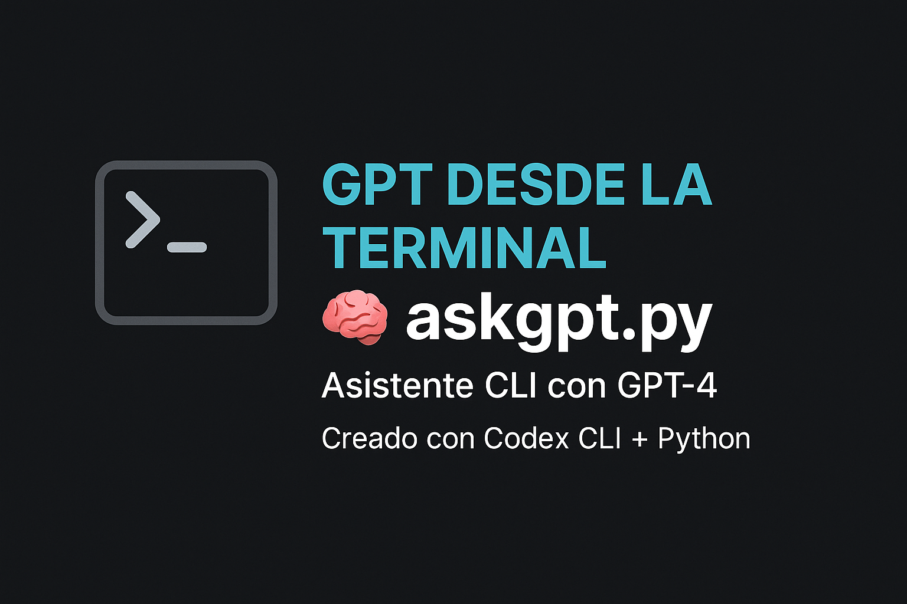

# 🤖 askgpt.py — Tu asistente local en la terminal con OpenAI

Este proyecto te permite hacer preguntas directamente desde tu consola a GPT-4 usando la API de OpenAI.



[](https://javiermorron.github.io/askgpt-cli/)
[](https://youtu.be/UAYdPv0EiUM?si=fpb0wHwZTQ5Bshk0)

---

## 🚀 ¿Cómo usarlo?

1. Cloná el repositorio y creá tu archivo `config.yaml` basado en `config_example.yaml`.

2. Instalá las dependencias:
```bash
pip install -r requirements.txt
```

3. Ejecutá una pregunta:
```bash
python askgpt.py "¿Qué es FastAPI y cómo se usa?"
```

4. O ingresá al modo interactivo:
```bash
python askgpt.py
```

---

## 🔐 Configuración (`config.yaml`)
```yaml
openai_api_key: "sk-..."
model: "gpt-4"
```

---

## 🎥 Demo de la app

> Terminal + IA + Python funcionando en tiempo real.  
👉 [Ver demo en GitHub Pages](https://javiermorron.github.io/askgpt-cli/)  
🎮 [Ver video en YouTube](https://youtu.be/UAYdPv0EiUM?si=fpb0wHwZTQ5Bshk0)

---

## ✨ Hecho con Codex CLI
Desarrollado con ayuda de [Codex CLI](https://github.com/openai/codex) para acelerar y mejorar el código con IA.

---

**Javier Morrón**  
*IA, automatización y propósito: ese es mi lenguaje.*
